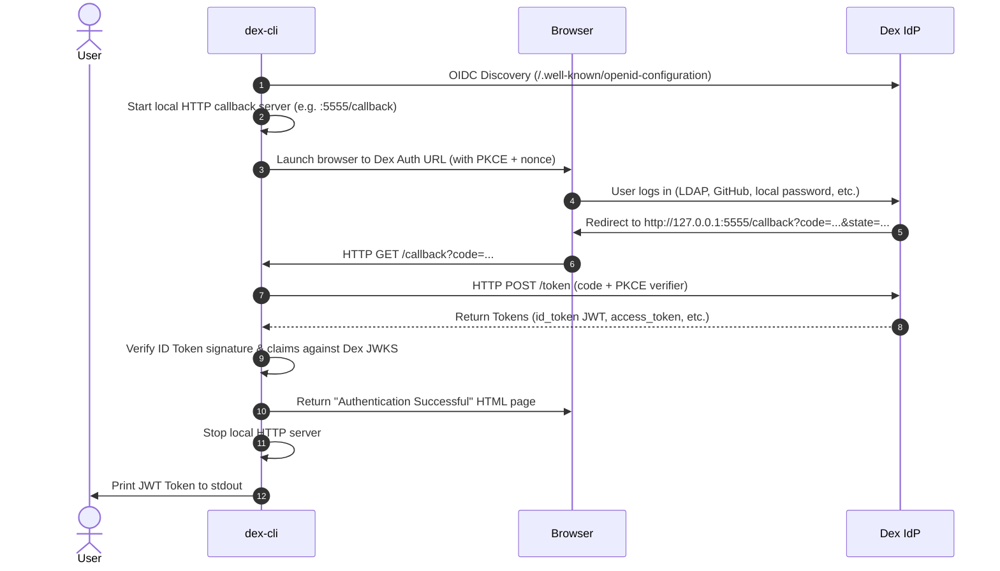

# dex-cli

A fast, lightweight Go CLI tool to retrieve OpenID Connect (OIDC) JWT tokens from [Dex IdP](https://github.com/dexidp/dex) via the Authorization Code Flow.

The CLI starts a local HTTP callback server, automatically launches your default browser at the Dex login page, captures the authentication callback, exchanges the authorization code for tokens, verifies the ID token, and outputs the JWT token to `stdout`.

---

## Features

- **Standard OIDC Flow**: Implements standard OpenID Connect Authorization Code Flow with PKCE (RFC 7636) for secure public client authentication (or client secrets for confidential clients).
- **Auto-Browser Launch**: Automatically opens your default web browser on Windows, macOS, and Linux, with clean fallback to manual copy-paste.
- **Embedded Web Server**: Listens on `localhost`/`127.0.0.1` to catch the redirect callback and automatically shuts down once authenticated.
- **Clean `stdout` Output**: Informational logs are sent strictly to `stderr`, leaving `stdout` clean for scripting (`TOKEN=$(dex-cli <URL>)`).
- **Modern Browser UI**: Serves a responsive, clean HTML status page with dark mode support upon successful authentication.
- **Multiple Output Formats**: Supports `id_token` (default raw JWT), `access_token`, `refresh_token`, `claims` (decoded JSON claims), and `json` (full token payload).
- **Development-Friendly**: Supports `-insecure-skip-tls-verify` for local Dex setups using self-signed TLS certificates.

---

## Authentication Flow



---

## Building and Installation

### Prerequisites
- Go 1.21+

### Build Binary
```bash
# Clone or navigate to the repository
cd calm-hawking

# Build the binary
go build -o dex-cli .

# On Windows:
go build -o dex-cli.exe .
```

---

## Usage

### Basic Usage
Retrieve the raw ID Token (JWT) from Dex:
```bash
dex-cli http://127.0.0.1:5556/dex
```

### Scripting & Shell Integration
Because status messages are printed to `stderr`, you can capture the raw JWT into environment variables or pipe it directly without any log pollution:

```bash
# Store in environment variable
export DEX_TOKEN=$(dex-cli http://127.0.0.1:5556/dex)

# Use with curl
curl -H "Authorization: Bearer $(dex-cli http://127.0.0.1:5556/dex)" https://api.example.com/data

# Quiet mode (suppress stderr status messages completely)
export DEX_TOKEN=$(dex-cli -q http://127.0.0.1:5556/dex)
```

### Inspect Decoded Claims
Output the decoded JWT payload as formatted JSON:
```bash
dex-cli -o claims http://127.0.0.1:5556/dex
```
Example output:
```json
{
  "aud": "example-app",
  "email": "admin@example.com",
  "email_verified": true,
  "exp": 1728080000,
  "groups": [
    "admins",
    "developers"
  ],
  "iat": 1728000000,
  "iss": "http://127.0.0.1:5556/dex",
  "name": "Admin",
  "sub": "CgVhZG1pbhIFbG9jYWw"
}
```

### Output Formats (`-o` / `-output`)
- `id_token` (default): Raw OIDC ID Token (JWT string)
- `access_token`: Raw OAuth2 Access Token
- `refresh_token`: Refresh Token (requires `offline_access` scope)
- `claims`: Pretty-printed JSON of the ID Token's claims payload
- `json`: Complete JSON output with all tokens, expiration, and decoded claims

### Headless / Remote SSH Server (`-no-browser`)
If running on a remote server without a graphical display:
```bash
dex-cli -no-browser http://dex.internal.example.com:5556/dex
```
The CLI will print the full authentication URL to the terminal so you can copy and open it in a local browser.

### Custom Client, Port, and Redirect URL
```bash
dex-cli \
  -client-id my-custom-app \
  -client-secret my-secret \
  -port 8080 \
  -redirect-url http://127.0.0.1:8080/callback \
  -scopes "openid,profile,email,groups" \
  http://127.0.0.1:5556/dex
```

### Local Development with Self-Signed Certificates
```bash
dex-cli -insecure-skip-tls-verify https://localhost:5556/dex
```

---

## Command-Line Options Reference

| Flag | Description | Default |
|------|-------------|---------|
| `<DEX_URL>` or `-dex-url` | Dex issuer URL (OIDC discovery endpoint) | *Required* |
| `-client-id` | OAuth2 Client ID registered in Dex | `example-app` |
| `-client-secret` | OAuth2 Client Secret (or set `DEX_CLIENT_SECRET`) | `""` |
| `-port` | Local server port for callback listener | `5555` |
| `-listen` | Local server bind address (e.g. `127.0.0.1:5555`) | `127.0.0.1:<port>` |
| `-redirect-url` | OAuth2 redirect URL registered in Dex | `http://127.0.0.1:<port>/callback` |
| `-scopes` | Scopes to request (comma or space separated) | `openid,profile,email,groups,offline_access` |
| `-output`, `-o` | Output format: `id_token`, `access_token`, `refresh_token`, `claims`, `json` | `id_token` |
| `-no-browser` | Disable automatic browser launch (prints URL to terminal) | `false` |
| `-no-pkce` | Disable PKCE for legacy Dex versions | `false` |
| `-timeout` | Maximum wait time for browser authentication | `5m0s` |
| `-insecure-skip-tls-verify` | Skip TLS certificate verification | `false` |
| `-skip-client-id-check` | Skip audience verification against client ID | `false` |
| `-quiet`, `-q` | Suppress status logs on stderr | `false` |
| `-version`, `-v` | Display version and exit | `false` |

---

## Testing with Local Dex (Quickstart)

If you want to test locally against a real Dex instance, you can run Dex via Docker:

### 1. Create a `dex-dev-config.yaml`
```yaml
issuer: http://127.0.0.1:5556/dex
storage:
  type: memory
web:
  http: 0.0.0.0:5556

staticClients:
  - id: example-app
    redirectURIs:
      - 'http://127.0.0.1:5555/callback'
      - 'http://localhost:5555/callback'
    name: 'Example App'
    public: true

enablePasswordDB: true
staticPasswords:
  - email: "admin@example.com"
    hash: "$2a$10$2b2cU8CPhOTaGrs1HRQuAueS7JTT5ZHsHSzYiFPm1leZck7Mc8T4W" # password: password
    username: "admin"
    userID: "08a5da84-ae62-4edd-bbc2-ad96ed454ed1"
```

### 2. Start Dex Container
```bash
docker run --rm -p 5556:5556 -v $(pwd)/dex-dev-config.yaml:/etc/dex/config.docker.yaml ghcr.io/dexidp/dex:v2.39.1 dex serve /etc/dex/config.docker.yaml
```

### 3. Run dex-cli
```bash
./dex-cli http://127.0.0.1:5556/dex
```
Log in using:
- **Email**: `admin@example.com`
- **Password**: `password`

The browser displays the authentication confirmation, and the CLI prints your JWT token!

---

## Running Automated Tests

Run the test suite including the end-to-end mock OIDC server test:
```bash
go test -v ./...
```
